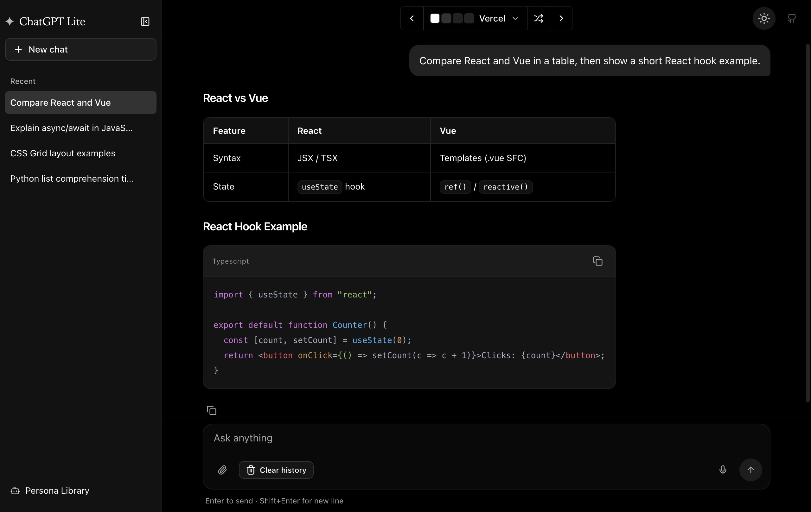

# ChatGPT Lite

English | [简体中文](./README.zh-CN.md)

## Demo

Try the [ChatGPT Lite Demo Site](https://gptlite.vercel.app).




## Features

ChatGPT Lite is a lightweight ChatGPT web application built with Next.js 16 and the [OpenAI Chat API](https://platform.openai.com/docs/api-reference/chat). It supports both OpenAI and Azure OpenAI accounts.

**Core Features:**

- **Real-time Streaming Responses** - Instant token-by-token output via Edge Runtime and Server-Sent Events
- **Rich Markdown Rendering** - Full markdown support with syntax highlighting and KaTeX math equations
- **Persona System** - Create and switch between custom AI personalities with different system prompts
- **Persistent Chat History** - All conversations saved locally with no database required
- **Dual Provider Support** - Works with both OpenAI and Azure OpenAI APIs

**User Experience:**

- **Responsive Design** - Mobile-first interface with collapsible sidebar, optimized for all screen sizes
- **40+ Built-in Themes** - Extensive theme library with light, dark, and colorful options
- **Multi-conversation Management** - Organize and switch between multiple chat threads
- **Privacy-focused** - Host your own instance without exposing API keys to end users

**Developer Experience:**

- Built with **Next.js 16 App Router**, **React 19**, **TypeScript**, and **Tailwind CSS v4**
- Clean, extensible architecture using **Shadcn/ui** components
- Easy deployment to Vercel, Docker, or any Node.js environment

If you’re looking for a more beginner-friendly ChatGPT UI codebase, check out [ChatGPT Minimal](https://github.com/blrchen/chatgpt-minimal).

## Prerequisites

You need an OpenAI or Azure OpenAI account.

## Deployment

Refer to the [Environment Variables](#environment-variables) section below for required configurations.

### Deploy to Vercel

Deploy instantly by clicking the button below:

[](https://vercel.com/new/clone?repository-url=https%3A%2F%2Fgithub.com%2Fblrchen%2Fchatgpt-lite&project-name=chatgpt-lite&framework=nextjs&repository-name=chatgpt-lite)

### Deploy with Docker

For OpenAI account users:

```bash
docker run -d -p 3000:3000 \
   -e OPENAI_API_KEY="<YOUR_OPENAI_API_KEY>" \
   blrchen/chatgpt-lite
```

For Azure OpenAI account users:

```bash
docker run -d -p 3000:3000 \
   -e AZURE_OPENAI_API_BASE_URL="<YOUR_AZURE_OPENAI_ENDPOINT>" \
   -e AZURE_OPENAI_API_KEY="<YOUR_AZURE_OPENAI_API_KEY>" \
   -e AZURE_OPENAI_DEPLOYMENT="<YOUR_AZURE_OPENAI_DEPLOYMENT_NAME>" \
   blrchen/chatgpt-lite
```

## Development

### Running Locally

1. Install Node.js 20.
2. Clone this repository.
3. Install dependencies using `npm install`.
4. Copy `.env.example` to `.env.local` and update environment variables.
5. Start the application with `npm run dev`.
6. Open `http://localhost:3000` in your browser.

## Environment Variables

The following environment variables are required:

For OpenAI account:

| Name                | Description                                                                                      | Default Value            |
| ------------------- | ------------------------------------------------------------------------------------------------ | ------------------------ |
| OPENAI_API_BASE_URL | (Optional) Use this if you plan to use a reverse proxy for `api.openai.com`.                     | `https://api.openai.com` |
| OPENAI_API_KEY      | Secret key obtained from the [OpenAI API website](https://platform.openai.com/account/api-keys). |                          |
| OPENAI_MODEL        | (Optional) GPT model to use                                                                      | `gpt-3.5-turbo`          |

For Azure OpenAI account:

| Name                      | Description                                      |
| ------------------------- | ------------------------------------------------ |
| AZURE_OPENAI_API_BASE_URL | Endpoint (e.g., <https://xxx.openai.azure.com>). |
| AZURE_OPENAI_API_KEY      | API Key.                                         |
| AZURE_OPENAI_DEPLOYMENT   | Model deployment name.                           |

## Acknowledgments

- Theme configurations from [tweakcn](https://github.com/jnsahaj/tweakcn)

## Contribution

PRs of all sizes are welcome.
