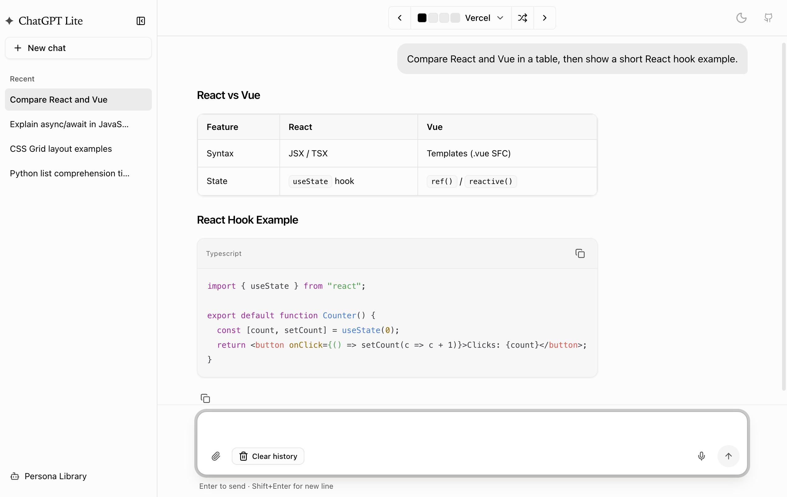

# ChatGPT Lite

English | [简体中文](./README.zh-CN.md)

## Demo

Visit the [ChatGPT Lite Demo Site](https://bit.ly/chatgpt-lite)

## Features

ChatGPT Lite is a lightweight ChatGPT web interface developed using Next.js and the [OpenAI Chat API](https://platform.openai.com/docs/api-reference/chat). It's compatible with both OpenAI and Azure OpenAI accounts.

- Deploy a custom ChatGPT web interface that supports markdown, prompt storage, and multi-person chats.
- Create a private, web-based ChatGPT for use among friends without sharing your API key.
- Clear and expandable codebase, ideal as a starting point for your next AI Next.js project.



For a beginner-friendly version of the ChatGPT UI codebase, visit [ChatGPT Minimal](https://github.com/blrchen/chatgpt-minimal).

## Prerequisites

You need an OpenAI or Azure OpenAI account.

## Deployment

Refer to the [Environment Variables](#environment-variables) section for necessary environment variables.

### Deploy on Vercel

Click the button below to deploy on Vercel:
[](https://vercel.com/new/clone?repository-url=https%3A%2F%2Fgithub.com%2Fblrchen%2Fchatgpt-lite&project-name=chatgpt-lite&framework=nextjs&repository-name=chatgpt-lite)

### Deploy with Docker

For OpenAI account users:

```
docker run -d -p 3000:3000 \
   -e OPENAI_API_KEY="<REPLACE-ME>" \
   blrchen/chatgpt-lite
```

For Azure OpenAI account users:

```
docker run -d -p 3000:3000 \
   -e AZURE_OPENAI_API_BASE_URL="<REPLACE-ME>" \
   -e AZURE_OPENAI_API_KEY="<REPLACE-ME>" \
   -e AZURE_OPENAI_DEPLOYMENT="<REPLACE-ME>" \
   blrchen/chatgpt-lite
```

## Development

### Running Locally

1. Install NodeJS 18.
2. Clone the repository.
3. Install dependencies with `npm install`.
4. Copy `.env.example` to `.env.local` and update environment variables.
5. Start the application using `npm run dev`.
6. Visit `http://localhost:3000` in your browser.

### Running Locally with Docker

1. Clone the repository and navigate to the root directory.
2. Update the `OPENAI_API_KEY` environment variable in the `docker-compose.yml` file.
3. Build the application using `docker-compose build .`.
4. Start it by running `docker-compose up -d`.

## Environment Variables

Required environment variables:

For OpenAI account:

| Name                | Description                                                                                             | Default Value            |
| ------------------- | ------------------------------------------------------------------------------------------------------- | ------------------------ |
| OPENAI_API_BASE_URL | Use if you plan to use a reverse proxy for `api.openai.com`.                                            | `https://api.openai.com` |
| OPENAI_API_KEY      | Secret key string obtained from the [OpenAI API website](https://platform.openai.com/account/api-keys). |
| OPENAI_MODEL        | Model of GPT used                                                                                       | `gpt-3.5-turbo`          |

For Azure OpenAI account:

| Name                      | Description                                    |
| ------------------------- | ---------------------------------------------- |
| AZURE_OPENAI_API_BASE_URL | Endpoint (e.g., https://xxx.openai.azure.com). |
| AZURE_OPENAI_API_KEY      | Key                                            |
| AZURE_OPENAI_DEPLOYMENT   | Model deployment name                          |

## Contribution

PRs of all sizes are welcome.
