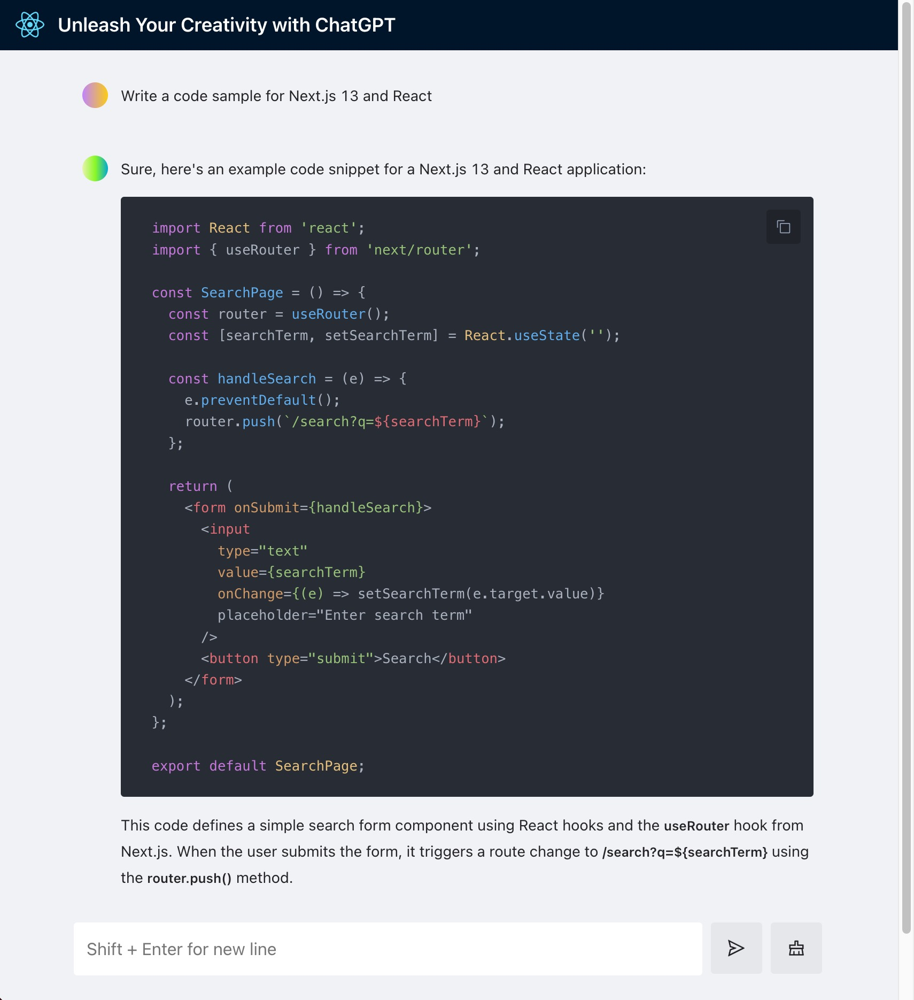

# GPT Lite

A lightweight version of ChatGPT UI. Support both Open AI and Azure Open AI accounts

# How to run locally

1. Clone the repo
2. Install dependencies with `npm install`
3. Run the app with `npm run dev`
4. Open [http://localhost:3000](http://localhost:3000) with your browser to see the result.

# How to deploy

To be updated
