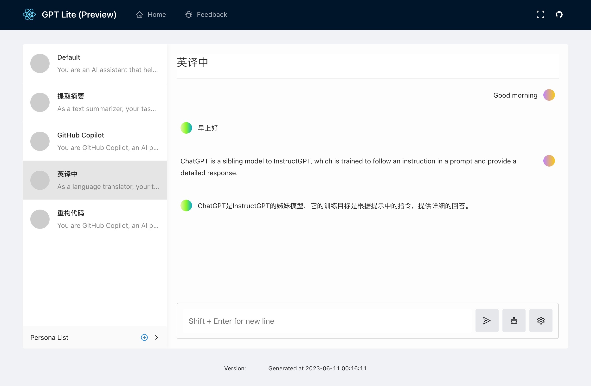

# ChatGPT Lite

[English](./README.md) | 简体中文

ChatGPT Lite 是一个基于 Next.js 和 OpenAI Streaming API 的 ChatGPT UI 应用，支持 OpenAI 和 Azure OpenAI 账户。

ChatGPT Lite 的示例用例包括：

- 作为官方网站的替代品，解决免费版连接不稳定和刷新问题，节省 Plus 订阅费用。
- 部署定制化 ChatGPT 程序，探索 OpenAI 的 ChatGPT、completion API 及 prompt 提示词等。
- 创建便于家人朋友共享使用的 ChatGPT 程序，无需共享 API 密钥。
- 高质量的代码库，是您下一个 AI Next.js 项目的绝佳起点。

访问 [ChatGPT Minimal](https://github.com/blrchen/chatgpt-minimal)，这是一个对初学者更友好的 ChatGPT UI 代码库。

[在线演示](https://gptlite.vercel.app)

## 前提条件

需要一个 OpenAI 账户或 Azure OpenAI 账户。

## 本地运行

1. 安装 NodeJS 18。
2. 克隆仓库。
3. 使用 `npm install` 安装依赖。
4. 将 `.env.example` 文件复制为 `.env.local` 然后更新环境变量。
5. 使用 `npm run dev` 启动应用程序。
6. 在浏览器中访问 `http://localhost:3000`。

## 使用 Docker 运行

1. 克隆仓库并导航到根目录。
2. 在 `docker-compose.yml` 文件中更新 `OPENAI_API_KEY` 环境变量。
3. 使用 `docker-compose build .` 构建应用程序。
4. 运行 `docker-compose up -d` 启动。

## 在 Vercel 上一键部署

点击下面的按钮一键部署到 Vercel：

## 环境变量

您需要使用在 [`.env.example`](.env.example) 中定义的环境变量来运行应用程序。以下是每个环境变量的解释

OpenAI 相关环境变量：

| 名称                | 描述                                                                                | 默认值                   |
| ------------------- | ----------------------------------------------------------------------------------- | ------------------------ |
| OPENAI_API_BASE_URL | 仅在打算为 `api.openai.com` 使用反向代理时使用。                                    | `https://api.openai.com` |
| OPENAI_API_KEY      | 从 [OpenAI API 网站](https://platform.openai.com/account/api-keys) 获取密钥字符串。 |

Azure Open AI 相关环境变量：

| 名称                      | 描述                                       |
| ------------------------- | ------------------------------------------ |
| AZURE_OPENAI_API_BASE_URL | 端点（如，https://xxx.openai.azure.com）。 |
| AZURE_OPENAI_API_KEY      | 密钥                                       |
| AZURE_OPENAI_DEPLOYMENT   | 模型部署名称                               |

## 贡献

欢迎提交各种大小的 PR。

## 免责声明

此代码仅用于演示和测试目的。
